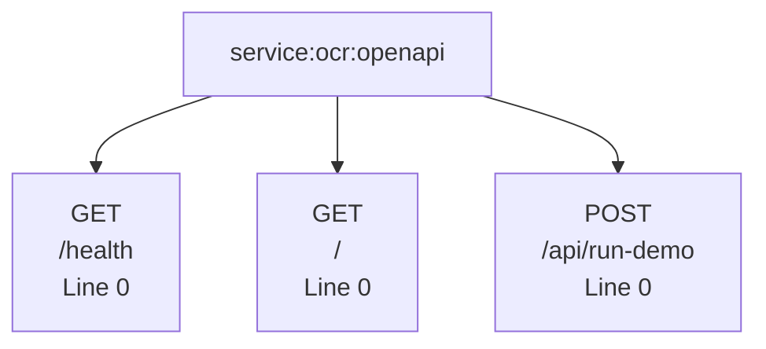

```mermaid
flowchart TD
    Page["service:audio:openapi"]

    EP0["POST\n/api/upload\nLine 0"]
    Page --> EP0
    EP1["POST\n/api/upload-session\nLine 0"]
    Page --> EP1
    EP2["GET\n/api/audio/{session_id}\nLine 0"]
    Page --> EP2
    EP3["POST\n/api/filter\nLine 0"]
    Page --> EP3
    EP4["POST\n/api/filter-chain\nLine 0"]
    Page --> EP4
    EP5["POST\n/api/effects/gain\nLine 0"]
    Page --> EP5
    EP6["POST\n/api/effects/dither\nLine 0"]
    Page --> EP6
    EP7["POST\n/api/effects/dcshift\nLine 0"]
    Page --> EP7
    EP8["POST\n/api/effects/overdrive\nLine 0"]
    Page --> EP8
    EP9["POST\n/api/effects/contrast\nLine 0"]
    Page --> EP9
    EP10["POST\n/api/effects/flanger\nLine 0"]
    Page --> EP10
    EP11["POST\n/api/effects/phaser\nLine 0"]
    Page --> EP11
    EP12["POST\n/api/enhance/pitch-shift\nLine 0"]
    Page --> EP12
    EP13["POST\n/api/enhance/speed\nLine 0"]
    Page --> EP13
    EP14["POST\n/api/enhance/preemphasis\nLine 0"]
    Page --> EP14
    EP15["POST\n/api/enhance/deemphasis\nLine 0"]
    Page --> EP15
    EP16["POST\n/api/enhance/volume\nLine 0"]
    Page --> EP16
    EP17["POST\n/api/enhance/fade\nLine 0"]
    Page --> EP17
    EP18["POST\n/api/enhance/add-noise\nLine 0"]
    Page --> EP18
    EP19["POST\n/api/analysis/spectrogram\nLine 0"]
    Page --> EP19
    EP20["POST\n/api/analysis/mel-spectrogram\nLine 0"]
    Page --> EP20
    EP21["POST\n/api/analysis/mfcc\nLine 0"]
    Page --> EP21
    EP22["POST\n/api/analysis/loudness\nLine 0"]
    Page --> EP22
    EP23["POST\n/api/analysis/spectral-centroid\nLine 0"]
    Page --> EP23
    EP24["POST\n/api/analysis/pitch\nLine 0"]
    Page --> EP24
    EP25["POST\n/api/separate\nLine 0"]
    Page --> EP25
    EP26["POST\n/api/vad\nLine 0"]
    Page --> EP26
    EP27["POST\n/api/resample\nLine 0"]
    Page --> EP27
    EP28["POST\n/api/effects/convolve\nLine 0"]
    Page --> EP28
    EP29["POST\n/api/effects/ir-convolve\nLine 0"]
    Page --> EP29
    EP30["POST\n/api/enhance/time-stretch\nLine 0"]
    Page --> EP30
    EP31["GET\n/api/info\nLine 0"]
    Page --> EP31
    EP32["GET\n/\nLine 0"]
    Page --> EP32
```

# API Endpoint Documentation
## Project: ecosystem_endpoints

**Total Files Analyzed:** 5
**Total Endpoints Found:** 274

---

## Overview Diagram

```mermaid
flowchart LR
    subgraph Frontend["🖥️ Frontend Pages"]
        F0["service:transcription:openapi"]
        F1["service:juris-search:openapi"]
        F2["service:garage:openapi"]
        F3["service:ocr:openapi"]
        F4["service:audio:openapi"]
    end

    subgraph APIs["🔌 API Endpoints"]
        subgraph [""]
            E0["GET: /"]
            E1["GET: /"]
            E2["GET: /"]
        end
        subgraph health["health"]
            E3["GET: /health"]
            E4["GET: /health"]
            E5["GET: /health"]
            E6["GET: /health"]
        end
        subgraph api["api"]
            E7["GET: /api/diarization/parameters"]
            E8["GET: /api/diarization/models/whisper"]
            E9["POST: /api/diarization/excerpt"]
            E10["POST: /api/diarization/excerpt_by_path"]
            E11["POST: /api/diarization/transcribe"]
            E12["POST: /api/diarization/transcribe/async"]
            E13["POST: /api/diarization/transcribe/guided"]
            E14["POST: /api/diarization/transcribe/guided/async"]
            E15["GET: /api/transcripts"]
            E16["GET: /api/transcripts/{transcript_id}"]
            E17["PUT: /api/transcripts/{transcript_id}"]
            E18["POST: /api/transcripts/import"]
            E19["POST: /api/transcripts/analyze"]
            E20["POST: /api/transcripts/search"]
            E21["POST: /api/transcripts/{transcript_id}/index?c..."]
            E22["POST: /api/transcripts/index-all"]
            E23["GET: /api/transcripts/status/{job_id}"]
            E24["GET: /api/transcripts/stream/{job_id}"]
            E25["POST: /api/transcripts/{transcript_id}/audit"]
            E26["POST: /api/transcripts/{transcript_id}/refine"]
            E27["POST: /api/transcripts/{transcript_id}/patch"]
            E28["GET: /api/transcripts/csv/list"]
            E29["POST: /api/transcripts/csv/import"]
            E30["GET: /api/transcripts/review/list?collection=..."]
            E31["POST: /api/transcripts/{transcript_id}/review/..."]
            E32["POST: /api/transcripts/{transcript_id}/review/..."]
            E33["POST: /api/transcripts/{transcript_id}/retrans..."]
            E34["GET: /api/transcripts/audio/list"]
            E35["GET: /api/transcripts/pinocchio/review/{trans..."]
            E36["POST: /api/transcripts/pinocchio/review/{trans..."]
            E37["GET: /api/projects"]
            E38["POST: /api/projects"]
            E39["GET: /api/projects/{project_id}"]
            E40["PATCH: /api/projects/{project_id}"]
            E41["DELETE: /api/projects/{project_id}"]
            E42["POST: /api/projects/{project_id}/audios"]
            E43["DELETE: /api/projects/{project_id}/audios/{canon..."]
            E44["POST: /api/projects/{project_id}/context_docs"]
            E45["DELETE: /api/projects/{project_id}/context_docs?..."]
            E46["POST: /api/projects/{project_id}/narratives"]
            E47["GET: /api/references"]
            E48["GET: /api/references/{canonical_name}/manifes..."]
            E49["GET: /api/references/{canonical_name}"]
            E50["POST: /api/references/{canonical_name}/upload"]
            E51["POST: /api/references/{canonical_name}/link"]
            E52["GET: /api/references/{canonical_name}/narrati..."]
            E53["POST: /api/chat"]
            E54["POST: /api/upload"]
            E55["POST: /api/search"]
            E56["GET: /api/search/status/{job_id}"]
            E57["GET: /api/results/{job_id}"]
            E58["GET: /api/search/history?limit={limit}"]
            E59["GET: /api/search/history/{filename}"]
            E60["POST: /api/download"]
            E61["GET: /api/download/status/{job_id}"]
            E62["POST: /api/download-batch"]
            E63["GET: /api/storage/paths"]
            E64["GET: /api/docx/index"]
            E65["GET: /api/json/index"]
            E66["POST: /api/docx/rebuild"]
            E67["POST: /api/json/rebuild"]
            E68["POST: /api/storage/rebuild"]
            E69["GET: /api/health"]
            E70["GET: /api/stats"]
            E71["GET: /api/courts"]
            E72["GET: /api/admin/qdrant-collections"]
            E73["GET: /api/master-index/stats"]
            E74["GET: /api/master-index/documents?tribunal={tr..."]
            E75["GET: /api/master-index/document/{doc_id}"]
            E76["GET: /api/master-index/document/{doc_id}/corr..."]
            E77["POST: /api/master-index/rebuild?force_ingest={..."]
            E78["POST: /api/master-index/pause?collection={coll..."]
            E79["POST: /api/master-index/resume?collection={col..."]
            E80["GET: /api/master-index/markdown?rebuild={rebu..."]
            E81["GET: /api/master-index/jurisprudence?rebuild=..."]
            E82["GET: /api/master-index/jurisprudence/markdown..."]
            E83["GET: /api/master-index/download-file?path={pa..."]
            E84["POST: /api/master-index/search"]
            E85["POST: /api/ingest-pdf/upload"]
            E86["POST: /api/ingest-pdf/process"]
            E87["GET: /api/transcripts"]
            E88["GET: /api/audio/{filename}"]
            E89["POST: /api/frameworks/regenerate-list"]
            E90["DELETE: /api/deepseek/{path}"]
            E91["PUT: /api/deepseek/{path}"]
            E92["POST: /api/deepseek/{path}"]
            E93["GET: /api/deepseek/{path}"]
            E94["POST: /api/run-demo"]
            E95["POST: /api/upload"]
            E96["POST: /api/upload-session"]
            E97["GET: /api/audio/{session_id}"]
            E98["POST: /api/filter"]
            E99["POST: /api/filter-chain"]
            E100["POST: /api/effects/gain"]
            E101["POST: /api/effects/dither"]
            E102["POST: /api/effects/dcshift"]
            E103["POST: /api/effects/overdrive"]
            E104["POST: /api/effects/contrast"]
            E105["POST: /api/effects/flanger"]
            E106["POST: /api/effects/phaser"]
            E107["POST: /api/enhance/pitch-shift"]
            E108["POST: /api/enhance/speed"]
            E109["POST: /api/enhance/preemphasis"]
            E110["POST: /api/enhance/deemphasis"]
            E111["POST: /api/enhance/volume"]
            E112["POST: /api/enhance/fade"]
            E113["POST: /api/enhance/add-noise"]
            E114["POST: /api/analysis/spectrogram"]
            E115["POST: /api/analysis/mel-spectrogram"]
            E116["POST: /api/analysis/mfcc"]
            E117["POST: /api/analysis/loudness"]
            E118["POST: /api/analysis/spectral-centroid"]
            E119["POST: /api/analysis/pitch"]
            E120["POST: /api/separate"]
            E121["POST: /api/vad"]
            E122["POST: /api/resample"]
            E123["POST: /api/effects/convolve"]
            E124["POST: /api/effects/ir-convolve"]
            E125["POST: /api/enhance/time-stretch"]
            E126["GET: /api/info"]
        end
        subgraph juris["juris"]
            E127["POST: /juris/api/chat"]
            E128["POST: /juris/api/upload"]
            E129["POST: /juris/api/search"]
            E130["GET: /juris/api/search/status/{job_id}"]
            E131["GET: /juris/api/results/{job_id}"]
            E132["GET: /juris/api/search/history?limit={limit}"]
            E133["GET: /juris/api/search/history/{filename}"]
            E134["POST: /juris/api/download"]
            E135["GET: /juris/api/download/status/{job_id}"]
            E136["POST: /juris/api/download-batch"]
            E137["GET: /juris/api/storage/paths"]
            E138["GET: /juris/api/docx/index"]
            E139["GET: /juris/api/json/index"]
            E140["POST: /juris/api/docx/rebuild"]
            E141["POST: /juris/api/json/rebuild"]
            E142["POST: /juris/api/storage/rebuild"]
            E143["GET: /juris/api/health"]
            E144["GET: /juris/health"]
            E145["GET: /juris/stats"]
            E146["GET: /juris/api/stats"]
            E147["GET: /juris/courts"]
            E148["GET: /juris/api/courts"]
            E149["GET: /juris/api/admin/qdrant-collections"]
            E150["GET: /juris/api/master-index/stats"]
            E151["GET: /juris/api/master-index/documents?tribun..."]
            E152["GET: /juris/api/master-index/document/{doc_id..."]
            E153["GET: /juris/api/master-index/document/{doc_id..."]
            E154["POST: /juris/api/master-index/rebuild?force_in..."]
            E155["POST: /juris/api/master-index/pause?collection..."]
            E156["POST: /juris/api/master-index/resume?collectio..."]
            E157["GET: /juris/api/master-index/markdown?rebuild..."]
            E158["GET: /juris/api/master-index/jurisprudence?re..."]
            E159["GET: /juris/api/master-index/jurisprudence/ma..."]
            E160["GET: /juris/api/master-index/download-file?pa..."]
            E161["POST: /juris/api/master-index/search"]
            E162["POST: /juris/api/ingest-pdf/upload"]
            E163["POST: /juris/api/ingest-pdf/process"]
        end
        subgraph stats["stats"]
            E164["GET: /stats"]
        end
        subgraph courts["courts"]
            E165["GET: /courts"]
        end
        subgraph v1["v1"]
            E166["GET: /v1/models"]
            E167["POST: /v1/chat/completions"]
            E168["POST: /v1/files/summarize"]
            E169["GET: /v1/files"]
            E170["POST: /v1/files"]
            E171["GET: /v1/files/list?path={path}"]
            E172["GET: /v1/files/read?path={path}"]
            E173["GET: /v1/files/transcripts"]
            E174["GET: /v1/files/laws"]
            E175["POST: /v1/files/upload/transcript"]
            E176["POST: /v1/files/upload/law"]
            E177["GET: /v1/assistants/"]
            E178["POST: /v1/assistants/"]
            E179["GET: /v1/assistants/{assistant_id}"]
            E180["PATCH: /v1/assistants/{assistant_id}"]
            E181["PUT: /v1/assistants/{assistant_id}"]
            E182["DELETE: /v1/assistants/{assistant_id}"]
            E183["POST: /v1/assistants/{assistant_id}/chat"]
            E184["POST: /v1/assistants/{assistant_id}/files"]
            E185["GET: /v1/assistants/{assistant_id}/files"]
            E186["DELETE: /v1/assistants/{assistant_id}/files/{fil..."]
            E187["POST: /v1/assistants/{assistant_id}/query-know..."]
            E188["POST: /v1/qdrant/connect"]
            E189["GET: /v1/qdrant/collections"]
            E190["POST: /v1/qdrant/collections"]
            E191["GET: /v1/qdrant/collections/{collection_name}..."]
            E192["POST: /v1/qdrant/collections/structured_ingest"]
            E193["POST: /v1/qdrant/collections/{collection_name}..."]
            E194["DELETE: /v1/qdrant/collections/{collection_name}"]
            E195["POST: /v1/qdrant/collections/{collection_name}..."]
            E196["POST: /v1/qdrant/embed-case-directory"]
            E197["POST: /v1/qdrant/embed-project-code"]
            E198["POST: /v1/qdrant/query"]
            E199["POST: /v1/qdrant/qdrant/search?collection_name..."]
            E200["POST: /v1/qdrant/search"]
            E201["POST: /v1/qdrant/collections/{collection_name}..."]
            E202["POST: /v1/knowledge/query"]
            E203["POST: /v1/knowledge/assistant/{assistant_id}/q..."]
            E204["POST: /v1/knowledge/ingest/file"]
            E205["DELETE: /v1/knowledge/collection/{collection_nam..."]
            E206["GET: /v1/knowledge/collection/{collection_nam..."]
            E207["GET: /v1/tools"]
            E208["POST: /v1/tools"]
            E209["GET: /v1/tools/{tool_name}"]
            E210["DELETE: /v1/tools/{tool_name}"]
            E211["POST: /v1/tools/{tool_name}/execute"]
            E212["POST: /v1/tools/execute"]
            E213["POST: /v1/tools/deep_reasoning"]
            E214["POST: /v1/prompt-engineer/generate"]
            E215["POST: /v1/prompt-engineer/analyze"]
            E216["POST: /v1/prompt-engineer/variations"]
            E217["POST: /v1/prompt-engineer/optimize"]
            E218["POST: /v1/prompt-engineer/evaluate"]
            E219["POST: /v1/prompt-engineer/improve"]
            E220["GET: /v1/prompt-engineer/examples?category={c..."]
            E221["POST: /v1/ingestion/ingest-directory?directory..."]
            E222["POST: /v1/ingestion/ingest-file?collection_nam..."]
            E223["POST: /v1/ingestion/ingest-legal-file?collecti..."]
            E224["POST: /v1/ingestion/analyze-document-structure"]
            E225["POST: /v1/ingestion/search?collection_name={co..."]
            E226["GET: /v1/ingestion/collections/{collection_na..."]
            E227["GET: /v1/neo4j/health"]
            E228["GET: /v1/neo4j/stats"]
            E229["POST: /v1/neo4j/cypher"]
            E230["POST: /v1/neo4j/rag-context"]
            E231["GET: /v1/openclaude/agents"]
            E232["POST: /v1/openclaude/agents"]
            E233["GET: /v1/openclaude/agents/{name}"]
            E234["PUT: /v1/openclaude/agents/{name}"]
            E235["DELETE: /v1/openclaude/agents/{name}"]
            E236["POST: /v1/openclaude/agents/{name}/run"]
            E237["POST: /v1/openclaude/agents/validate"]
            E238["POST: /v1/openclaude/agents/import-from-assist..."]
            E239["POST: /v1/openclaude/agents/export-to-assistan..."]
            E240["POST: /v1/openclaude/agents/import-markdown"]
            E241["GET: /v1/openclaude/catalog/agents"]
            E242["GET: /v1/openclaude/catalog/agents/{name}"]
            E243["POST: /v1/openclaude/agents/import-from-catalo..."]
            E244["GET: /v1/ecosystem/report"]
            E245["GET: /v1/ecosystem/metadata"]
            E246["GET: /v1/threads/"]
            E247["POST: /v1/threads/"]
            E248["GET: /v1/threads/{thread_id}"]
            E249["DELETE: /v1/threads/{thread_id}"]
            E250["POST: /v1/threads/{thread_id}/messages"]
            E251["GET: /v1/threads/{thread_id}/messages?limit={..."]
            E252["POST: /v1/threads/{thread_id}/runs"]
            E253["POST: /v1/threads/{thread_id}/files"]
            E254["GET: /v1/files/{file_id}/content"]
            E255["DELETE: /v1/files/{file_id}"]
            E256["POST: /v1/assistants/{assistant_id}/tools"]
            E257["POST: /v1/assistants/{assistant_id}/deepseek"]
            E258["POST: /v1/deepseek-engineer/chat"]
            E259["POST: /v1/assistants/deepseek-stream-proxy"]
        end
        subgraph legal_ingestion["legal_ingestion"]
            E260["POST: /legal-ingestion/upload-csv?collection_n..."]
            E261["POST: /legal-ingestion/ingest-file?file_path={..."]
            E262["POST: /legal-ingestion/search/{collection_name..."]
            E263["GET: /legal-ingestion/collections"]
            E264["GET: /legal-ingestion/collection/{collection_..."]
            E265["DELETE: /legal-ingestion/collection/{collection_..."]
        end
        subgraph v2["v2"]
            E266["POST: /v2/legal-ingestion/ingest-legal-file-en..."]
            E267["POST: /v2/legal-ingestion/ingest-legal-folder"]
            E268["POST: /v2/legal-ingestion/analyze-document-str..."]
            E269["POST: /v2/transcripts/analyze"]
            E270["POST: /v2/transcripts/ingest-enhanced"]
            E271["POST: /v2/transcripts/ingest-json"]
        end
        subgraph debug_schema["debug_schema"]
            E272["GET: /debug-schema"]
        end
        subgraph debug_routes["debug_routes"]
            E273["GET: /debug-routes"]
        end
    end

    F0 --> E0
    F0 --> E3
    F0 --> E7
    F0 --> E8
    F0 --> E9
    F0 --> E10
    F0 --> E11
    F0 --> E12
    F0 --> E13
    F0 --> E14
    F0 --> E15
    F0 --> E16
    F0 --> E17
    F0 --> E18
    F0 --> E19
    F0 --> E20
    F0 --> E21
    F0 --> E22
    F0 --> E23
    F0 --> E24
    F0 --> E25
    F0 --> E26
    F0 --> E27
    F0 --> E28
    F0 --> E29
    F0 --> E30
    F0 --> E31
    F0 --> E32
    F0 --> E33
    F0 --> E34
    F0 --> E35
    F0 --> E36
    F0 --> E37
    F0 --> E38
    F0 --> E39
    F0 --> E40
    F0 --> E41
    F0 --> E42
    F0 --> E43
    F0 --> E44
    F0 --> E45
    F0 --> E46
    F0 --> E47
    F0 --> E48
    F0 --> E49
    F0 --> E50
    F0 --> E51
    F0 --> E52
    F1 --> E53
    F1 --> E54
    F1 --> E127
    F1 --> E128
    F1 --> E55
    F1 --> E56
    F1 --> E57
    F1 --> E58
    F1 --> E59
    F1 --> E129
    F1 --> E130
    F1 --> E131
    F1 --> E132
    F1 --> E133
    F1 --> E60
    F1 --> E61
    F1 --> E62
    F1 --> E134
    F1 --> E135
    F1 --> E136
    F1 --> E63
    F1 --> E64
    F1 --> E65
    F1 --> E66
    F1 --> E67
    F1 --> E68
    F1 --> E137
    F1 --> E138
    F1 --> E139
    F1 --> E140
    F1 --> E141
    F1 --> E142
    F1 --> E69
    F1 --> E4
    F1 --> E164
    F1 --> E70
    F1 --> E165
    F1 --> E71
    F1 --> E72
    F1 --> E143
    F1 --> E144
    F1 --> E145
    F1 --> E146
    F1 --> E147
    F1 --> E148
    F1 --> E149
    F1 --> E73
    F1 --> E74
    F1 --> E75
    F1 --> E76
    F1 --> E77
    F1 --> E78
    F1 --> E79
    F1 --> E80
    F1 --> E81
    F1 --> E82
    F1 --> E83
    F1 --> E84
    F1 --> E150
    F1 --> E151
    F1 --> E152
    F1 --> E153
    F1 --> E154
    F1 --> E155
    F1 --> E156
    F1 --> E157
    F1 --> E158
    F1 --> E159
    F1 --> E160
    F1 --> E161
    F1 --> E85
    F1 --> E86
    F1 --> E162
    F1 --> E163
    F2 --> E166
    F2 --> E167
    F2 --> E168
    F2 --> E169
    F2 --> E170
    F2 --> E171
    F2 --> E172
    F2 --> E173
    F2 --> E174
    F2 --> E175
    F2 --> E176
    F2 --> E87
    F2 --> E88
    F2 --> E177
    F2 --> E178
    F2 --> E179
    F2 --> E180
    F2 --> E181
    F2 --> E182
    F2 --> E183
    F2 --> E184
    F2 --> E185
    F2 --> E186
    F2 --> E187
    F2 --> E188
    F2 --> E189
    F2 --> E190
    F2 --> E191
    F2 --> E192
    F2 --> E193
    F2 --> E194
    F2 --> E195
    F2 --> E196
    F2 --> E197
    F2 --> E198
    F2 --> E199
    F2 --> E200
    F2 --> E201
    F2 --> E202
    F2 --> E203
    F2 --> E204
    F2 --> E205
    F2 --> E206
    F2 --> E207
    F2 --> E208
    F2 --> E209
    F2 --> E210
    F2 --> E211
    F2 --> E212
    F2 --> E213
    F2 --> E214
    F2 --> E215
    F2 --> E216
    F2 --> E217
    F2 --> E218
    F2 --> E219
    F2 --> E220
    F2 --> E221
    F2 --> E222
    F2 --> E223
    F2 --> E224
    F2 --> E225
    F2 --> E226
    F2 --> E260
    F2 --> E261
    F2 --> E262
    F2 --> E263
    F2 --> E264
    F2 --> E265
    F2 --> E266
    F2 --> E267
    F2 --> E268
    F2 --> E269
    F2 --> E270
    F2 --> E271
    F2 --> E227
    F2 --> E228
    F2 --> E229
    F2 --> E230
    F2 --> E231
    F2 --> E232
    F2 --> E233
    F2 --> E234
    F2 --> E235
    F2 --> E236
    F2 --> E237
    F2 --> E238
    F2 --> E239
    F2 --> E240
    F2 --> E241
    F2 --> E242
    F2 --> E243
    F2 --> E244
    F2 --> E245
    F2 --> E246
    F2 --> E247
    F2 --> E248
    F2 --> E249
    F2 --> E250
    F2 --> E251
    F2 --> E252
    F2 --> E253
    F2 --> E272
    F2 --> E273
    F2 --> E5
    F2 --> E89
    F2 --> E254
    F2 --> E255
    F2 --> E256
    F2 --> E257
    F2 --> E258
    F2 --> E259
    F2 --> E90
    F2 --> E91
    F2 --> E92
    F2 --> E93
    F3 --> E6
    F3 --> E1
    F3 --> E94
    F4 --> E95
    F4 --> E96
    F4 --> E97
    F4 --> E98
    F4 --> E99
    F4 --> E100
    F4 --> E101
    F4 --> E102
    F4 --> E103
    F4 --> E104
    F4 --> E105
    F4 --> E106
    F4 --> E107
    F4 --> E108
    F4 --> E109
    F4 --> E110
    F4 --> E111
    F4 --> E112
    F4 --> E113
    F4 --> E114
    F4 --> E115
    F4 --> E116
    F4 --> E117
    F4 --> E118
    F4 --> E119
    F4 --> E120
    F4 --> E121
    F4 --> E122
    F4 --> E123
    F4 --> E124
    F4 --> E125
    F4 --> E126
    F4 --> E2
```

---

## Endpoints by File

### 📄 service:audio:openapi
**Path:** `service:audio:openapi`  
**Type:** OPENAPI  
**API Clients Used:** http



| Line | Method | Endpoint | Request | Response | Function | Notes |
|------|--------|----------|---------|----------|----------|-------|
| 0 | `POST` | `/api/upload` | multipart/form-data body (Body_upload_audio_api_up | application/json response: Successful Response | `upload_audio_api_upload_post` | — |
| 0 | `POST` | `/api/upload-session` | multipart/form-data body (Body_upload_to_session_a | application/json response: Successful Response | `upload_to_session_api_upload_session_post` | — |
| 0 | `GET` | `/api/audio/{session_id}` | — | application/json response: Successful Response | `get_audio_api_audio__session_id__get` | — |
| 0 | `POST` | `/api/filter` | multipart/form-data body (Body_apply_filter_api_fi | application/json response: Successful Response | `apply_filter_api_filter_post` | — |
| 0 | `POST` | `/api/filter-chain` | multipart/form-data body (Body_apply_filter_chain_ | application/json response: Successful Response | `apply_filter_chain_api_filter_chain_post` | — |
| 0 | `POST` | `/api/effects/gain` | multipart/form-data body (Body_apply_gain_api_effe | application/json response: Successful Response | `apply_gain_api_effects_gain_post` | — |
| 0 | `POST` | `/api/effects/dither` | multipart/form-data body (Body_apply_dither_api_ef | application/json response: Successful Response | `apply_dither_api_effects_dither_post` | — |
| 0 | `POST` | `/api/effects/dcshift` | multipart/form-data body (Body_apply_dcshift_api_e | application/json response: Successful Response | `apply_dcshift_api_effects_dcshift_post` | — |
| 0 | `POST` | `/api/effects/overdrive` | multipart/form-data body (Body_apply_overdrive_api | application/json response: Successful Response | `apply_overdrive_api_effects_overdrive_post` | — |
| 0 | `POST` | `/api/effects/contrast` | multipart/form-data body (Body_apply_contrast_api_ | application/json response: Successful Response | `apply_contrast_api_effects_contrast_post` | — |
| 0 | `POST` | `/api/effects/flanger` | multipart/form-data body (Body_apply_flanger_api_e | application/json response: Successful Response | `apply_flanger_api_effects_flanger_post` | — |
| 0 | `POST` | `/api/effects/phaser` | multipart/form-data body (Body_apply_phaser_api_ef | application/json response: Successful Response | `apply_phaser_api_effects_phaser_post` | — |
| 0 | `POST` | `/api/enhance/pitch-shift` | multipart/form-data body (Body_pitch_shift_api_enh | application/json response: Successful Response | `pitch_shift_api_enhance_pitch_shift_post` | — |
| 0 | `POST` | `/api/enhance/speed` | multipart/form-data body (Body_change_speed_api_en | application/json response: Successful Response | `change_speed_api_enhance_speed_post` | — |
| 0 | `POST` | `/api/enhance/preemphasis` | multipart/form-data body (Body_preemphasis_api_enh | application/json response: Successful Response | `preemphasis_api_enhance_preemphasis_post` | — |
| 0 | `POST` | `/api/enhance/deemphasis` | multipart/form-data body (Body_deemphasis_api_enha | application/json response: Successful Response | `deemphasis_api_enhance_deemphasis_post` | — |
| 0 | `POST` | `/api/enhance/volume` | multipart/form-data body (Body_change_volume_api_e | application/json response: Successful Response | `change_volume_api_enhance_volume_post` | — |
| 0 | `POST` | `/api/enhance/fade` | multipart/form-data body (Body_apply_fade_api_enha | application/json response: Successful Response | `apply_fade_api_enhance_fade_post` | — |
| 0 | `POST` | `/api/enhance/add-noise` | multipart/form-data body (Body_add_noise_api_enhan | application/json response: Successful Response | `add_noise_api_enhance_add_noise_post` | — |
| 0 | `POST` | `/api/analysis/spectrogram` | multipart/form-data body (Body_compute_spectrogram | application/json response: Successful Response | `compute_spectrogram_api_analysis_spectrogram_post` | — |
| 0 | `POST` | `/api/analysis/mel-spectrogram` | multipart/form-data body (Body_compute_mel_spectro | application/json response: Successful Response | `compute_mel_spectrogram_api_analysis_mel_spectrogram_post` | — |
| 0 | `POST` | `/api/analysis/mfcc` | multipart/form-data body (Body_compute_mfcc_api_an | application/json response: Successful Response | `compute_mfcc_api_analysis_mfcc_post` | — |
| 0 | `POST` | `/api/analysis/loudness` | multipart/form-data body (Body_compute_loudness_ap | application/json response: Successful Response | `compute_loudness_api_analysis_loudness_post` | — |
| 0 | `POST` | `/api/analysis/spectral-centroid` | multipart/form-data body (Body_compute_spectral_ce | application/json response: Successful Response | `compute_spectral_centroid_api_analysis_spectral_centroid_post` | — |
| 0 | `POST` | `/api/analysis/pitch` | multipart/form-data body (Body_detect_pitch_api_an | application/json response: Successful Response | `detect_pitch_api_analysis_pitch_post` | — |
| 0 | `POST` | `/api/separate` | multipart/form-data body (Body_separate_sources_ap | application/json response: Successful Response | `separate_sources_api_separate_post` | — |
| 0 | `POST` | `/api/vad` | multipart/form-data body (Body_voice_activity_dete | application/json response: Successful Response | `voice_activity_detection_api_vad_post` | — |
| 0 | `POST` | `/api/resample` | multipart/form-data body (Body_resample_audio_api_ | application/json response: Successful Response | `resample_audio_api_resample_post` | — |
| 0 | `POST` | `/api/effects/convolve` | multipart/form-data body (Body_apply_convolve_api_ | application/json response: Successful Response | `apply_convolve_api_effects_convolve_post` | — |
| 0 | `POST` | `/api/effects/ir-convolve` | multipart/form-data body (Body_apply_ir_convolve_a | application/json response: Successful Response | `apply_ir_convolve_api_effects_ir_convolve_post` | — |
| 0 | `POST` | `/api/enhance/time-stretch` | multipart/form-data body (Body_time_stretch_api_en | application/json response: Successful Response | `time_stretch_api_enhance_time_stretch_post` | — |
| 0 | `GET` | `/api/info` | — | application/json response: Successful Response | `get_info_api_info_get` | — |
| 0 | `GET` | `/` | — | application/json response: Successful Response | `serve_frontend__get` | — |

---

### 📄 service:garage:openapi
**Path:** `service:garage:openapi`  
**Type:** OPENAPI  
**API Clients Used:** http


| Line | Method | Endpoint | Request | Response | Function | Notes |
|------|--------|----------|---------|----------|----------|-------|
| 0 | `GET` | `/v1/models` | — | application/json response: Successful Response | `list_models_v1_models_get` | tags=Models |
| 0 | `POST` | `/v1/chat/completions` | application/json body (ChatRequest) | application/json response: Successful Response | `chat_completions_v1_chat_completions_post` | tags=Chat |
| 0 | `POST` | `/v1/files/summarize` | application/json body (SummarizeRequest) | application/json response: Successful Response | `summarize_files_v1_files_summarize_post` | tags=files |
| 0 | `GET` | `/v1/files` | — | application/json response: Successful Response | `list_files_v1_files_get` | tags=Files |
| 0 | `POST` | `/v1/files` | multipart/form-data body (Body_upload_file_v1_file | application/json response: Successful Response | `upload_file_v1_files_post` | tags=files |
| 0 | `GET` | `/v1/files/list?path={path}` | — | application/json response: Successful Response | `list_files_in_directory_v1_files_list_get` | tags=files |
| 0 | `GET` | `/v1/files/read?path={path}` | — | application/json response: Successful Response | `read_file_v1_files_read_get` | tags=files |
| 0 | `GET` | `/v1/files/transcripts` | — | application/json response: Successful Response | `list_transcript_files_v1_files_transcripts_get` | tags=files |
| 0 | `GET` | `/v1/files/laws` | — | application/json response: Successful Response | `list_law_files_v1_files_laws_get` | tags=files |
| 0 | `POST` | `/v1/files/upload/transcript` | multipart/form-data body (Body_upload_transcript_f | application/json response: Successful Response | `upload_transcript_file_v1_files_upload_transcript_post` | tags=files |
| 0 | `POST` | `/v1/files/upload/law` | multipart/form-data body (Body_upload_law_file_v1_ | application/json response: Successful Response | `upload_law_file_v1_files_upload_law_post` | tags=files |
| 0 | `GET` | `/api/transcripts` | — | application/json response: Successful Response | `get_transcripts_api_transcripts_get` | tags=files |
| 0 | `GET` | `/api/audio/{filename}` | — | application/json response: Successful Response | `get_audio_file_api_audio__filename__get` | tags=files |
| 0 | `GET` | `/v1/assistants/` | — | application/json response: Successful Response | `list_assistants_v1_assistants__get` | tags=Assistants |
| 0 | `POST` | `/v1/assistants/` | application/json body (AssistantCreateRequest) | application/json response: Successful Response | `create_assistant_v1_assistants__post` | tags=Assistants |
| 0 | `GET` | `/v1/assistants/{assistant_id}` | — | application/json response: Successful Response | `get_assistant_v1_assistants__assistant_id__get` | tags=Assistants |
| 0 | `PATCH` | `/v1/assistants/{assistant_id}` | application/json body (AssistantUpdateRequest) | application/json response: Successful Response | `update_assistant_v1_assistants__assistant_id__patch` | tags=Assistants |
| 0 | `PUT` | `/v1/assistants/{assistant_id}` | application/json body (AssistantUpdateRequest) | application/json response: Successful Response | `replace_assistant_v1_assistants__assistant_id__put` | tags=Assistants |
| 0 | `DELETE` | `/v1/assistants/{assistant_id}` | — | application/json response: Successful Response | `delete_assistant_v1_assistants__assistant_id__delete` | tags=Assistants |
| 0 | `POST` | `/v1/assistants/{assistant_id}/chat` | application/json body (ChatRequest) | application/json response: Successful Response | `chat_with_assistant_v1_assistants__assistant_id__chat_post` | tags=Assistants |
| 0 | `POST` | `/v1/assistants/{assistant_id}/files` | — | application/json response: Successful Response | `attach_file_to_assistant_v1_assistants__assistant_id__files_post` | tags=Assistants |
| 0 | `GET` | `/v1/assistants/{assistant_id}/files` | — | application/json response: Successful Response | `list_assistant_files_v1_assistants__assistant_id__files_get` | tags=Assistants |
| 0 | `DELETE` | `/v1/assistants/{assistant_id}/files/{file_id}` | — | application/json response: Successful Response | `detach_file_from_assistant_v1_assistants__assistant_id__files__file_id__delete` | tags=Assistants |
| 0 | `POST` | `/v1/assistants/{assistant_id}/query-knowledge` | — | application/json response: Successful Response | `query_assistant_knowledge_v1_assistants__assistant_id__query_knowledge_post` | tags=Assistants |
| 0 | `POST` | `/v1/qdrant/connect` | — | application/json response: Successful Response | `connect_to_qdrant_v1_qdrant_connect_post` | tags=Qdrant |
| 0 | `GET` | `/v1/qdrant/collections` | — | application/json response: Successful Response | `list_collections_v1_qdrant_collections_get` | tags=Qdrant |
| 0 | `POST` | `/v1/qdrant/collections` | application/json body (CreateCollectionRequest) | application/json response: Successful Response | `create_collection_v1_qdrant_collections_post` | tags=Qdrant |
| 0 | `GET` | `/v1/qdrant/collections/{collection_name}/summary` | — | application/json response: Successful Response | `get_collection_summary_v1_qdrant_collections__collection_name__summary_get` | tags=Qdrant |
| 0 | `POST` | `/v1/qdrant/collections/structured_ingest` | application/json body (StructuredIngestRequest) | application/json response: Successful Response | `structured_ingest_v1_qdrant_collections_structured_ingest_post` | tags=Qdrant |
| 0 | `POST` | `/v1/qdrant/collections/{collection_name}/ensure-indexes` | — | application/json response: Successful Response | `ensure_legal_indexes_v1_qdrant_collections__collection_name__ensure_indexes_post` | tags=Qdrant |
| 0 | `DELETE` | `/v1/qdrant/collections/{collection_name}` | — | application/json response: Successful Response | `delete_collection_v1_qdrant_collections__collection_name__delete` | tags=Qdrant |
| 0 | `POST` | `/v1/qdrant/collections/{collection_name}/ingest` | multipart/form-data body (Body_ingest_files_v1_qdr | application/json response: Successful Response | `ingest_files_v1_qdrant_collections__collection_name__ingest_post` | tags=Qdrant |
| 0 | `POST` | `/v1/qdrant/embed-case-directory` | application/json body (EmbedCaseDirectoryRequest) | application/json response: Successful Response | `embed_case_directory_v1_qdrant_embed_case_directory_post` | tags=Qdrant |
| 0 | `POST` | `/v1/qdrant/embed-project-code` | application/json body (EmbedProjectCodeRequest) | application/json response: Successful Response | `embed_project_code_v1_qdrant_embed_project_code_post` | tags=Qdrant |
| 0 | `POST` | `/v1/qdrant/query` | application/json body (QueryRequest) | application/json response: Successful Response | `query_points_v1_qdrant_query_post` | tags=Qdrant |
| 0 | `POST` | `/v1/qdrant/qdrant/search?collection_name={collection_name}&q...` | — | application/json response: Successful Response | `search_qdrant_v1_qdrant_qdrant_search_post` | tags=Qdrant |
| 0 | `POST` | `/v1/qdrant/search` | application/json body (routes__qdrant_router__Sear | application/json response: Successful Response | `search_with_text_v1_qdrant_search_post` | tags=Qdrant |
| 0 | `POST` | `/v1/qdrant/collections/{collection_name}/query/vector` | application/json body (QueryVectorRequest) | application/json response: Successful Response | `query_with_vector_v1_qdrant_collections__collection_name__query_vector_post` | tags=Qdrant |
| 0 | `POST` | `/v1/knowledge/query` | application/json body (KnowledgeQueryRequest) | application/json response: Successful Response | `knowledge_query_v1_knowledge_query_post` | tags=knowledge |
| 0 | `POST` | `/v1/knowledge/assistant/{assistant_id}/query` | application/json body (KnowledgeQueryRequest) | application/json response: Successful Response | `assistant_query_knowledge_v1_knowledge_assistant__assistant_id__query_post` | tags=knowledge |
| 0 | `POST` | `/v1/knowledge/ingest/file` | multipart/form-data body (Body_ingest_file_v1_know | application/json response: Successful Response | `ingest_file_v1_knowledge_ingest_file_post` | tags=knowledge |
| 0 | `DELETE` | `/v1/knowledge/collection/{collection_name}/clear` | — | application/json response: Successful Response | `clear_collection_v1_knowledge_collection__collection_name__clear_delete` | tags=knowledge |
| 0 | `GET` | `/v1/knowledge/collection/{collection_name}/stats` | — | application/json response: Successful Response | `get_collection_stats_v1_knowledge_collection__collection_name__stats_get` | tags=knowledge |
| 0 | `GET` | `/v1/tools` | — | application/json response: Successful Response | `list_tools_v1_tools_get` | — |
| 0 | `POST` | `/v1/tools` | application/json body (ToolCreateRequest) | application/json response: Successful Response | `create_tool_v1_tools_post` | — |
| 0 | `GET` | `/v1/tools/{tool_name}` | — | application/json response: Successful Response | `get_tool_v1_tools__tool_name__get` | — |
| 0 | `DELETE` | `/v1/tools/{tool_name}` | — | application/json response: Successful Response | `delete_tool_v1_tools__tool_name__delete` | — |
| 0 | `POST` | `/v1/tools/{tool_name}/execute` | — | application/json response: Successful Response | `execute_tool_v1_tools__tool_name__execute_post` | — |
| 0 | `POST` | `/v1/tools/execute` | application/json body (ToolExecuteRequest) | application/json response: Successful Response | `execute_tool_by_name_v1_tools_execute_post` | — |
| 0 | `POST` | `/v1/tools/deep_reasoning` | application/json body (Body_deep_reasoning_v1_tool | application/json response: Successful Response | `deep_reasoning_v1_tools_deep_reasoning_post` | — |
| 0 | `POST` | `/v1/prompt-engineer/generate` | application/json body (PromptGenerationRequest) | application/json response: Successful Response | `generate_prompt_v1_prompt_engineer_generate_post` | tags=Prompt Engineer |
| 0 | `POST` | `/v1/prompt-engineer/analyze` | application/json body (AnalysisRequest) | application/json response: Successful Response | `analyze_needs_v1_prompt_engineer_analyze_post` | tags=Prompt Engineer |
| 0 | `POST` | `/v1/prompt-engineer/variations` | application/json body (VariationRequest) | application/json response: Successful Response | `generate_variations_v1_prompt_engineer_variations_post` | tags=Prompt Engineer |
| 0 | `POST` | `/v1/prompt-engineer/optimize` | application/json body (OptimizationRequest) | application/json response: Successful Response | `optimize_prompt_v1_prompt_engineer_optimize_post` | tags=Prompt Engineer |
| 0 | `POST` | `/v1/prompt-engineer/evaluate` | application/json body (EvaluationRequest) | application/json response: Successful Response | `evaluate_prompt_v1_prompt_engineer_evaluate_post` | tags=Prompt Engineer |
| 0 | `POST` | `/v1/prompt-engineer/improve` | application/json body (ImprovementRequest) | application/json response: Successful Response | `suggest_improvements_v1_prompt_engineer_improve_post` | tags=Prompt Engineer |
| 0 | `GET` | `/v1/prompt-engineer/examples?category={category}` | — | application/json response: Successful Response | `get_prompt_examples_v1_prompt_engineer_examples_get` | tags=Prompt Engineer |
| 0 | `POST` | `/v1/ingestion/ingest-directory?directory_path={directory_pat...` | application/json body (anyOf) | application/json response: Successful Response | `ingest_directory_v1_ingestion_ingest_directory_post` | tags=Ingestion |
| 0 | `POST` | `/v1/ingestion/ingest-file?collection_name={collection_name}&...` | multipart/form-data body (Body_ingest_file_v1_inge | application/json response: Successful Response | `ingest_file_v1_ingestion_ingest_file_post` | tags=Ingestion |
| 0 | `POST` | `/v1/ingestion/ingest-legal-file?collection_name={collection_...` | multipart/form-data body (Body_ingest_legal_file_v | application/json response: Successful Response | `ingest_legal_file_v1_ingestion_ingest_legal_file_post` | tags=Ingestion |
| 0 | `POST` | `/v1/ingestion/analyze-document-structure` | multipart/form-data body (Body_analyze_document_st | application/json response: Successful Response | `analyze_document_structure_v1_ingestion_analyze_document_structure_post` | tags=Ingestion |
| 0 | `POST` | `/v1/ingestion/search?collection_name={collection_name}&query...` | — | application/json response: Successful Response | `search_documents_v1_ingestion_search_post` | tags=Ingestion |
| 0 | `GET` | `/v1/ingestion/collections/{collection_name}/info` | — | application/json response: Successful Response | `get_collection_info_v1_ingestion_collections__collection_name__info_get` | tags=Ingestion |
| 0 | `POST` | `/legal-ingestion/upload-csv?collection_name={collection_name...` | multipart/form-data body (Body_upload_and_ingest_c | application/json response: Successful Response | `upload_and_ingest_csv_legal_ingestion_upload_csv_post` | tags=Legal Document Ingestion |
| 0 | `POST` | `/legal-ingestion/ingest-file?file_path={file_path}` | application/json body (IngestionRequest) | application/json response: Successful Response | `ingest_from_file_path_legal_ingestion_ingest_file_post` | tags=Legal Document Ingestion |
| 0 | `POST` | `/legal-ingestion/search/{collection_name}` | application/json body (routes__legal_ingestion__Se | application/json response: Successful Response | `search_legal_documents_legal_ingestion_search__collection_name__post` | tags=Legal Document Ingestion |
| 0 | `GET` | `/legal-ingestion/collections` | — | application/json response: Successful Response | `list_collections_legal_ingestion_collections_get` | tags=Legal Document Ingestion |
| 0 | `GET` | `/legal-ingestion/collection/{collection_name}/info` | — | application/json response: Successful Response | `get_collection_info_legal_ingestion_collection__collection_name__info_get` | tags=Legal Document Ingestion |
| 0 | `DELETE` | `/legal-ingestion/collection/{collection_name}` | — | application/json response: Successful Response | `delete_collection_legal_ingestion_collection__collection_name__delete` | tags=Legal Document Ingestion |
| 0 | `POST` | `/v2/legal-ingestion/ingest-legal-file-enhanced` | multipart/form-data body (Body_ingest_legal_file_e | application/json response: Successful Response | `ingest_legal_file_enhanced_v2_legal_ingestion_ingest_legal_file_enhanced_post` | tags=Legal Document Ingestion  |
| 0 | `POST` | `/v2/legal-ingestion/ingest-legal-folder` | application/json body (FolderIngestionRequest) | application/json response: Successful Response | `ingest_legal_folder_v2_legal_ingestion_ingest_legal_folder_post` | tags=Legal Document Ingestion  |
| 0 | `POST` | `/v2/legal-ingestion/analyze-document-structure` | multipart/form-data body (Body_analyze_document_st | application/json response: Successful Response | `analyze_document_structure_v2_legal_ingestion_analyze_document_structure_post` | tags=Legal Document Ingestion  |
| 0 | `POST` | `/v2/transcripts/analyze` | multipart/form-data body (Body_analyze_transcript_ | application/json response: Successful Response | `analyze_transcript_structure_v2_transcripts_analyze_post` | tags=Transcript Ingestion |
| 0 | `POST` | `/v2/transcripts/ingest-enhanced` | multipart/form-data body (Body_ingest_transcript_e | application/json response: Successful Response | `ingest_transcript_enhanced_v2_transcripts_ingest_enhanced_post` | tags=Transcript Ingestion |
| 0 | `POST` | `/v2/transcripts/ingest-json` | application/x-www-form-urlencoded body (Body_inges | application/json response: Successful Response | `ingest_transcript_json_v2_transcripts_ingest_json_post` | tags=Transcript Ingestion |
| 0 | `GET` | `/v1/neo4j/health` | — | application/json response: Successful Response | `health_v1_neo4j_health_get` | tags=neo4j |
| 0 | `GET` | `/v1/neo4j/stats` | — | application/json response: Successful Response | `stats_v1_neo4j_stats_get` | tags=neo4j |
| 0 | `POST` | `/v1/neo4j/cypher` | application/json body (CypherRequest) | application/json response: Successful Response | `cypher_v1_neo4j_cypher_post` | tags=neo4j |
| 0 | `POST` | `/v1/neo4j/rag-context` | application/json body (RagContextRequest) | application/json response: Successful Response | `rag_context_v1_neo4j_rag_context_post` | tags=neo4j |
| 0 | `GET` | `/v1/openclaude/agents` | — | application/json response: Successful Response | `list_agents_v1_openclaude_agents_get` | tags=OpenClaude |
| 0 | `POST` | `/v1/openclaude/agents` | application/json body (AgentCreateRequest) | application/json response: Successful Response | `create_agent_v1_openclaude_agents_post` | tags=OpenClaude |
| 0 | `GET` | `/v1/openclaude/agents/{name}` | — | application/json response: Successful Response | `get_agent_v1_openclaude_agents__name__get` | tags=OpenClaude |
| 0 | `PUT` | `/v1/openclaude/agents/{name}` | application/json body (AgentCreateRequest) | application/json response: Successful Response | `update_agent_v1_openclaude_agents__name__put` | tags=OpenClaude |
| 0 | `DELETE` | `/v1/openclaude/agents/{name}` | — | application/json response: Successful Response | `delete_agent_v1_openclaude_agents__name__delete` | tags=OpenClaude |
| 0 | `POST` | `/v1/openclaude/agents/{name}/run` | application/json body (AgentRunRequest) | application/json response: Successful Response | `run_agent_v1_openclaude_agents__name__run_post` | tags=OpenClaude |
| 0 | `POST` | `/v1/openclaude/agents/validate` | application/json body (AgentValidateRequest) | application/json response: Successful Response | `validate_agent_v1_openclaude_agents_validate_post` | tags=OpenClaude |
| 0 | `POST` | `/v1/openclaude/agents/import-from-assistant/{assistant_id}` | — | application/json response: Successful Response | `import_from_assistant_v1_openclaude_agents_import_from_assistant__assistant_id__post` | tags=OpenClaude |
| 0 | `POST` | `/v1/openclaude/agents/export-to-assistant/{name}` | — | application/json response: Successful Response | `export_to_assistant_v1_openclaude_agents_export_to_assistant__name__post` | tags=OpenClaude |
| 0 | `POST` | `/v1/openclaude/agents/import-markdown` | application/json body (AgentImportMarkdownRequest) | application/json response: Successful Response | `import_from_markdown_v1_openclaude_agents_import_markdown_post` | tags=OpenClaude |
| 0 | `GET` | `/v1/openclaude/catalog/agents` | — | application/json response: Successful Response | `catalog_list_agents_v1_openclaude_catalog_agents_get` | tags=OpenClaude |
| 0 | `GET` | `/v1/openclaude/catalog/agents/{name}` | — | application/json response: Successful Response | `catalog_get_agent_v1_openclaude_catalog_agents__name__get` | tags=OpenClaude |
| 0 | `POST` | `/v1/openclaude/agents/import-from-catalog/{name}` | — | application/json response: Successful Response | `import_from_catalog_v1_openclaude_agents_import_from_catalog__name__post` | tags=OpenClaude |
| 0 | `GET` | `/v1/ecosystem/report` | — | application/json response: Successful Response | `get_ecosystem_report_v1_ecosystem_report_get` | tags=Ecosystem |
| 0 | `GET` | `/v1/ecosystem/metadata` | — | application/json response: Successful Response | `get_ecosystem_metadata_v1_ecosystem_metadata_get` | tags=Ecosystem |
| 0 | `GET` | `/v1/threads/` | — | application/json response: Successful Response | `list_threads_v1_threads__get` | tags=Threads |
| 0 | `POST` | `/v1/threads/` | application/json body (ThreadCreateRequest) | application/json response: Successful Response | `create_thread_v1_threads__post` | tags=Threads |
| 0 | `GET` | `/v1/threads/{thread_id}` | — | application/json response: Successful Response | `get_thread_v1_threads__thread_id__get` | tags=Threads |
| 0 | `DELETE` | `/v1/threads/{thread_id}` | — | application/json response: Successful Response | `delete_thread_v1_threads__thread_id__delete` | tags=Threads |
| 0 | `POST` | `/v1/threads/{thread_id}/messages` | application/json body (MessageCreateRequest) | application/json response: Successful Response | `add_message_v1_threads__thread_id__messages_post` | tags=Threads |
| 0 | `GET` | `/v1/threads/{thread_id}/messages?limit={limit}` | — | application/json response: Successful Response | `list_messages_v1_threads__thread_id__messages_get` | tags=Threads |
| 0 | `POST` | `/v1/threads/{thread_id}/runs` | application/json body (RunCreateRequest) | application/json response: Successful Response | `create_run_v1_threads__thread_id__runs_post` | tags=Threads |
| 0 | `POST` | `/v1/threads/{thread_id}/files` | application/json body (object) | application/json response: Successful Response | `attach_file_to_thread_v1_threads__thread_id__files_post` | tags=Threads |
| 0 | `GET` | `/debug-schema` | — | application/json response: Successful Response | `debug_schema_debug_schema_get` | tags=Debug |
| 0 | `GET` | `/debug-routes` | — | application/json response: Successful Response | `debug_routes_debug_routes_get` | tags=Debug |
| 0 | `GET` | `/health` | — | application/json response: Successful Response | `health_check_health_get` | tags=System |
| 0 | `POST` | `/api/frameworks/regenerate-list` | — | application/json response: Successful Response | `regenerate_framework_list_api_frameworks_regenerate_list_post` | tags=System |
| 0 | `GET` | `/v1/files/{file_id}/content` | — | Successful Response | `get_file_content_v1_files__file_id__content_get` | tags=Files |
| 0 | `DELETE` | `/v1/files/{file_id}` | — | application/json response: Successful Response | `delete_file_v1_files__file_id__delete` | tags=Files |
| 0 | `POST` | `/v1/assistants/{assistant_id}/tools` | application/json body (AssignToolRequest) | application/json response: Successful Response | `assign_tool_to_assistant_v1_assistants__assistant_id__tools_post` | tags=Assistants |
| 0 | `POST` | `/v1/assistants/{assistant_id}/deepseek` | — | application/json response: Successful Response | `deepseek_proxy_v1_assistants__assistant_id__deepseek_post` | tags=DeepSeek |
| 0 | `POST` | `/v1/deepseek-engineer/chat` | application/json body (DeepSeekRequest) | application/json response: Successful Response | `deepseek_engineer_chat_v1_deepseek_engineer_chat_post` | tags=DeepSeek |
| 0 | `POST` | `/v1/assistants/deepseek-stream-proxy` | — | application/json response: Successful Response | `deepseek_streaming_proxy_v1_assistants_deepseek_stream_proxy_post` | — |
| 0 | `DELETE` | `/api/deepseek/{path}` | — | application/json response: Successful Response | `deepseek_gateway_delete` | tags=Gateway |
| 0 | `PUT` | `/api/deepseek/{path}` | — | application/json response: Successful Response | `deepseek_gateway_put` | tags=Gateway |
| 0 | `POST` | `/api/deepseek/{path}` | — | application/json response: Successful Response | `deepseek_gateway_post` | tags=Gateway |
| 0 | `GET` | `/api/deepseek/{path}` | — | application/json response: Successful Response | `deepseek_gateway_get` | tags=Gateway |

---

### 📄 service:juris-search:openapi
**Path:** `service:juris-search:openapi`  
**Type:** OPENAPI  
**API Clients Used:** http


| Line | Method | Endpoint | Request | Response | Function | Notes |
|------|--------|----------|---------|----------|----------|-------|
| 0 | `POST` | `/api/chat` | application/json body (ChatRequest) | application/json response: Successful Response | `chat_endpoint_api_chat_post` | — |
| 0 | `POST` | `/api/upload` | multipart/form-data body (Body_upload_file_api_upl | application/json response: Successful Response | `upload_file_api_upload_post` | — |
| 0 | `POST` | `/juris/api/chat` | application/json body (ChatRequest) | application/json response: Successful Response | `chat_endpoint_juris_api_chat_post` | — |
| 0 | `POST` | `/juris/api/upload` | multipart/form-data body (Body_upload_file_juris_a | application/json response: Successful Response | `upload_file_juris_api_upload_post` | — |
| 0 | `POST` | `/api/search` | application/json body (SearchFields) | application/json response: Successful Response | `start_search_api_search_post` | — |
| 0 | `GET` | `/api/search/status/{job_id}` | — | application/json response: Successful Response | `search_status_api_search_status__job_id__get` | — |
| 0 | `GET` | `/api/results/{job_id}` | — | application/json response: Successful Response | `get_results_api_results__job_id__get` | — |
| 0 | `GET` | `/api/search/history?limit={limit}` | — | application/json response: Successful Response | `list_search_history_api_search_history_get` | — |
| 0 | `GET` | `/api/search/history/{filename}` | — | application/json response: Successful Response | `get_search_history_file_api_search_history__filename__get` | — |
| 0 | `POST` | `/juris/api/search` | application/json body (SearchFields) | application/json response: Successful Response | `start_search_juris_api_search_post` | — |
| 0 | `GET` | `/juris/api/search/status/{job_id}` | — | application/json response: Successful Response | `search_status_juris_api_search_status__job_id__get` | — |
| 0 | `GET` | `/juris/api/results/{job_id}` | — | application/json response: Successful Response | `get_results_juris_api_results__job_id__get` | — |
| 0 | `GET` | `/juris/api/search/history?limit={limit}` | — | application/json response: Successful Response | `list_search_history_juris_api_search_history_get` | — |
| 0 | `GET` | `/juris/api/search/history/{filename}` | — | application/json response: Successful Response | `get_search_history_file_juris_api_search_history__filename__get` | — |
| 0 | `POST` | `/api/download` | application/json body (DownloadRequest) | application/json response: Successful Response | `download_inteiro_teor_api_download_post` | — |
| 0 | `GET` | `/api/download/status/{job_id}` | — | application/json response: Successful Response | `download_status_api_download_status__job_id__get` | — |
| 0 | `POST` | `/api/download-batch` | application/json body (BatchDownloadRequest) | application/json response: Successful Response | `download_batch_compat_api_download_batch_post` | — |
| 0 | `POST` | `/juris/api/download` | application/json body (DownloadRequest) | application/json response: Successful Response | `download_inteiro_teor_juris_api_download_post` | — |
| 0 | `GET` | `/juris/api/download/status/{job_id}` | — | application/json response: Successful Response | `download_status_juris_api_download_status__job_id__get` | — |
| 0 | `POST` | `/juris/api/download-batch` | application/json body (BatchDownloadRequest) | application/json response: Successful Response | `download_batch_compat_juris_api_download_batch_post` | — |
| 0 | `GET` | `/api/storage/paths` | — | application/json response: Successful Response | `get_storage_paths_api_storage_paths_get` | — |
| 0 | `GET` | `/api/docx/index` | — | application/json response: Successful Response | `docx_index_api_docx_index_get` | — |
| 0 | `GET` | `/api/json/index` | — | application/json response: Successful Response | `json_index_api_json_index_get` | — |
| 0 | `POST` | `/api/docx/rebuild` | — | application/json response: Successful Response | `docx_rebuild_api_docx_rebuild_post` | — |
| 0 | `POST` | `/api/json/rebuild` | — | application/json response: Successful Response | `json_rebuild_api_json_rebuild_post` | — |
| 0 | `POST` | `/api/storage/rebuild` | — | application/json response: Successful Response | `storage_rebuild_api_storage_rebuild_post` | — |
| 0 | `GET` | `/juris/api/storage/paths` | — | application/json response: Successful Response | `get_storage_paths_juris_api_storage_paths_get` | — |
| 0 | `GET` | `/juris/api/docx/index` | — | application/json response: Successful Response | `docx_index_juris_api_docx_index_get` | — |
| 0 | `GET` | `/juris/api/json/index` | — | application/json response: Successful Response | `json_index_juris_api_json_index_get` | — |
| 0 | `POST` | `/juris/api/docx/rebuild` | — | application/json response: Successful Response | `docx_rebuild_juris_api_docx_rebuild_post` | — |
| 0 | `POST` | `/juris/api/json/rebuild` | — | application/json response: Successful Response | `json_rebuild_juris_api_json_rebuild_post` | — |
| 0 | `POST` | `/juris/api/storage/rebuild` | — | application/json response: Successful Response | `storage_rebuild_juris_api_storage_rebuild_post` | — |
| 0 | `GET` | `/api/health` | — | application/json response: Successful Response | `health_api_health_get` | — |
| 0 | `GET` | `/health` | — | application/json response: Successful Response | `health_legacy_health_get` | — |
| 0 | `GET` | `/stats` | — | application/json response: Successful Response | `stats_compat_stats_get` | — |
| 0 | `GET` | `/api/stats` | — | application/json response: Successful Response | `stats_compat_api_stats_get` | — |
| 0 | `GET` | `/courts` | — | application/json response: Successful Response | `list_courts_courts_get` | — |
| 0 | `GET` | `/api/courts` | — | application/json response: Successful Response | `list_courts_api_courts_get` | — |
| 0 | `GET` | `/api/admin/qdrant-collections` | — | application/json response: Successful Response | `qdrant_collections_api_admin_qdrant_collections_get` | — |
| 0 | `GET` | `/juris/api/health` | — | application/json response: Successful Response | `health_juris_api_health_get` | — |
| 0 | `GET` | `/juris/health` | — | application/json response: Successful Response | `health_legacy_juris_health_get` | — |
| 0 | `GET` | `/juris/stats` | — | application/json response: Successful Response | `stats_compat_juris_stats_get` | — |
| 0 | `GET` | `/juris/api/stats` | — | application/json response: Successful Response | `stats_compat_juris_api_stats_get` | — |
| 0 | `GET` | `/juris/courts` | — | application/json response: Successful Response | `list_courts_juris_courts_get` | — |
| 0 | `GET` | `/juris/api/courts` | — | application/json response: Successful Response | `list_courts_juris_api_courts_get` | — |
| 0 | `GET` | `/juris/api/admin/qdrant-collections` | — | application/json response: Successful Response | `qdrant_collections_juris_api_admin_qdrant_collections_get` | — |
| 0 | `GET` | `/api/master-index/stats` | — | application/json response: Successful Response | `master_index_stats_api_master_index_stats_get` | — |
| 0 | `GET` | `/api/master-index/documents?tribunal={tribunal}&year={year}&...` | — | application/json response: Successful Response | `master_index_documents_api_master_index_documents_get` | — |
| 0 | `GET` | `/api/master-index/document/{doc_id}` | — | application/json response: Successful Response | `master_index_document_api_master_index_document__doc_id__get` | — |
| 0 | `GET` | `/api/master-index/document/{doc_id}/correlations` | — | application/json response: Successful Response | `master_index_document_correlations_api_master_index_document__doc_id__correlations_get` | — |
| 0 | `POST` | `/api/master-index/rebuild?force_ingest={force_ingest}` | — | application/json response: Successful Response | `master_index_rebuild_api_master_index_rebuild_post` | — |
| 0 | `POST` | `/api/master-index/pause?collection={collection}` | — | application/json response: Successful Response | `master_index_pause_api_master_index_pause_post` | — |
| 0 | `POST` | `/api/master-index/resume?collection={collection}` | — | application/json response: Successful Response | `master_index_resume_api_master_index_resume_post` | — |
| 0 | `GET` | `/api/master-index/markdown?rebuild={rebuild}` | — | application/json response: Successful Response | `master_index_markdown_api_master_index_markdown_get` | — |
| 0 | `GET` | `/api/master-index/jurisprudence?rebuild={rebuild}` | — | application/json response: Successful Response | `master_index_jurisprudence_api_master_index_jurisprudence_get` | — |
| 0 | `GET` | `/api/master-index/jurisprudence/markdown?rebuild={rebuild}` | — | application/json response: Successful Response | `master_index_jurisprudence_markdown_api_master_index_jurisprudence_markdown_get` | — |
| 0 | `GET` | `/api/master-index/download-file?path={path}` | — | application/json response: Successful Response | `master_index_download_file_api_master_index_download_file_get` | — |
| 0 | `POST` | `/api/master-index/search` | application/json body (object) | application/json response: Successful Response | `master_index_semantic_search_api_master_index_search_post` | — |
| 0 | `GET` | `/juris/api/master-index/stats` | — | application/json response: Successful Response | `master_index_stats_juris_api_master_index_stats_get` | — |
| 0 | `GET` | `/juris/api/master-index/documents?tribunal={tribunal}&year={...` | — | application/json response: Successful Response | `master_index_documents_juris_api_master_index_documents_get` | — |
| 0 | `GET` | `/juris/api/master-index/document/{doc_id}` | — | application/json response: Successful Response | `master_index_document_juris_api_master_index_document__doc_id__get` | — |
| 0 | `GET` | `/juris/api/master-index/document/{doc_id}/correlations` | — | application/json response: Successful Response | `master_index_document_correlations_juris_api_master_index_document__doc_id__correlations_get` | — |
| 0 | `POST` | `/juris/api/master-index/rebuild?force_ingest={force_ingest}` | — | application/json response: Successful Response | `master_index_rebuild_juris_api_master_index_rebuild_post` | — |
| 0 | `POST` | `/juris/api/master-index/pause?collection={collection}` | — | application/json response: Successful Response | `master_index_pause_juris_api_master_index_pause_post` | — |
| 0 | `POST` | `/juris/api/master-index/resume?collection={collection}` | — | application/json response: Successful Response | `master_index_resume_juris_api_master_index_resume_post` | — |
| 0 | `GET` | `/juris/api/master-index/markdown?rebuild={rebuild}` | — | application/json response: Successful Response | `master_index_markdown_juris_api_master_index_markdown_get` | — |
| 0 | `GET` | `/juris/api/master-index/jurisprudence?rebuild={rebuild}` | — | application/json response: Successful Response | `master_index_jurisprudence_juris_api_master_index_jurisprudence_get` | — |
| 0 | `GET` | `/juris/api/master-index/jurisprudence/markdown?rebuild={rebu...` | — | application/json response: Successful Response | `master_index_jurisprudence_markdown_juris_api_master_index_jurisprudence_markdown_get` | — |
| 0 | `GET` | `/juris/api/master-index/download-file?path={path}` | — | application/json response: Successful Response | `master_index_download_file_juris_api_master_index_download_file_get` | — |
| 0 | `POST` | `/juris/api/master-index/search` | application/json body (object) | application/json response: Successful Response | `master_index_semantic_search_juris_api_master_index_search_post` | — |
| 0 | `POST` | `/api/ingest-pdf/upload` | multipart/form-data body (Body_upload_pdf_api_inge | application/json response: Successful Response | `upload_pdf_api_ingest_pdf_upload_post` | — |
| 0 | `POST` | `/api/ingest-pdf/process` | application/json body (ProcessPdfRequest) | application/json response: Successful Response | `process_pdf_api_ingest_pdf_process_post` | — |
| 0 | `POST` | `/juris/api/ingest-pdf/upload` | multipart/form-data body (Body_upload_pdf_juris_ap | application/json response: Successful Response | `upload_pdf_juris_api_ingest_pdf_upload_post` | — |
| 0 | `POST` | `/juris/api/ingest-pdf/process` | application/json body (ProcessPdfRequest) | application/json response: Successful Response | `process_pdf_juris_api_ingest_pdf_process_post` | — |

---

### 📄 service:ocr:openapi
**Path:** `service:ocr:openapi`  
**Type:** OPENAPI  
**API Clients Used:** http



| Line | Method | Endpoint | Request | Response | Function | Notes |
|------|--------|----------|---------|----------|----------|-------|
| 0 | `GET` | `/health` | — | application/json response: Successful Response | `health_health_get` | — |
| 0 | `GET` | `/` | — | application/json response: Successful Response | `root__get` | — |
| 0 | `POST` | `/api/run-demo` | — | application/json response: Successful Response | `run_demo_api_run_demo_post` | — |

---

### 📄 service:transcription:openapi
**Path:** `service:transcription:openapi`  
**Type:** OPENAPI  
**API Clients Used:** http


| Line | Method | Endpoint | Request | Response | Function | Notes |
|------|--------|----------|---------|----------|----------|-------|
| 0 | `GET` | `/` | — | application/json response: Successful Response | `health_check__get` | tags=health |
| 0 | `GET` | `/health` | — | application/json response: Successful Response | `health_health_get` | tags=health |
| 0 | `GET` | `/api/diarization/parameters` | — | application/json response: Successful Response | `list_parameter_definitions_api_diarization_parameters_get` | tags=parameters |
| 0 | `GET` | `/api/diarization/models/whisper` | — | application/json response: Successful Response | `list_whisper_models_api_diarization_models_whisper_get` | tags=parameters |
| 0 | `POST` | `/api/diarization/excerpt` | multipart/form-data body (Body_diarization_excerpt | application/json response: Successful Response | `diarization_excerpt_api_diarization_excerpt_post` | tags=diarization |
| 0 | `POST` | `/api/diarization/excerpt_by_path` | application/json body (ExcerptByPathRequest) | application/json response: Successful Response | `diarization_excerpt_by_path_api_diarization_excerpt_by_path_post` | tags=diarization |
| 0 | `POST` | `/api/diarization/transcribe` | multipart/form-data body (Body_diarization_transcr | application/json response: Successful Response | `diarization_transcribe_api_diarization_transcribe_post` | tags=transcription |
| 0 | `POST` | `/api/diarization/transcribe/async` | multipart/form-data body (Body_diarization_transcr | application/json response: Successful Response | `diarization_transcribe_async_api_diarization_transcribe_async_post` | tags=transcription |
| 0 | `POST` | `/api/diarization/transcribe/guided` | multipart/form-data body (Body_diarization_transcr | application/json response: Successful Response | `diarization_transcribe_guided_api_diarization_transcribe_guided_post` | tags=transcription |
| 0 | `POST` | `/api/diarization/transcribe/guided/async` | multipart/form-data body (Body_diarization_transcr | application/json response: Successful Response | `diarization_transcribe_guided_async_api_diarization_transcribe_guided_async_post` | tags=transcription |
| 0 | `GET` | `/api/transcripts` | — | application/json response: Successful Response | `list_transcripts_api_transcripts_get` | tags=transcripts |
| 0 | `GET` | `/api/transcripts/{transcript_id}` | — | application/json response: Successful Response | `get_transcript_api_transcripts__transcript_id__get` | tags=transcripts |
| 0 | `PUT` | `/api/transcripts/{transcript_id}` | application/json body (MetadataUpdate) | application/json response: Successful Response | `update_transcript_metadata_api_transcripts__transcript_id__put` | tags=transcripts |
| 0 | `POST` | `/api/transcripts/import` | application/json body (ImportTranscriptsPayload) | application/json response: Successful Response | `import_transcripts_api_transcripts_import_post` | tags=transcripts |
| 0 | `POST` | `/api/transcripts/analyze` | application/json body (AnalyzeRequest) | application/json response: Successful Response | `analyze_transcript_api_transcripts_analyze_post` | tags=transcripts |
| 0 | `POST` | `/api/transcripts/search` | application/json body (SearchRequest) | application/json response: Successful Response | `search_transcripts_api_transcripts_search_post` | tags=transcripts |
| 0 | `POST` | `/api/transcripts/{transcript_id}/index?collection={collectio...` | — | application/json response: Successful Response | `index_transcript_api_transcripts__transcript_id__index_post` | tags=transcripts |
| 0 | `POST` | `/api/transcripts/index-all` | — | application/json response: Successful Response | `index_all_transcripts_api_transcripts_index_all_post` | tags=transcripts |
| 0 | `GET` | `/api/transcripts/status/{job_id}` | — | application/json response: Successful Response | `get_progress_status_api_transcripts_status__job_id__get` | tags=transcripts |
| 0 | `GET` | `/api/transcripts/stream/{job_id}` | — | application/json response: Successful Response | `stream_progress_api_transcripts_stream__job_id__get` | tags=transcripts |
| 0 | `POST` | `/api/transcripts/{transcript_id}/audit` | — | application/json response: Successful Response | `audit_transcript_route_api_transcripts__transcript_id__audit_post` | tags=transcripts |
| 0 | `POST` | `/api/transcripts/{transcript_id}/refine` | application/json body (anyOf) | application/json response: Successful Response | `refine_transcript_route_api_transcripts__transcript_id__refine_post` | tags=transcripts |
| 0 | `POST` | `/api/transcripts/{transcript_id}/patch` | application/json body (PatchSegmentsPayload) | application/json response: Successful Response | `patch_transcript_route_api_transcripts__transcript_id__patch_post` | tags=transcripts |
| 0 | `GET` | `/api/transcripts/csv/list` | — | application/json response: Successful Response | `list_csvs_api_transcripts_csv_list_get` | tags=transcripts |
| 0 | `POST` | `/api/transcripts/csv/import` | application/json body (CSVImportPayload) | application/json response: Successful Response | `import_csv_api_transcripts_csv_import_post` | tags=transcripts |
| 0 | `GET` | `/api/transcripts/review/list?collection={collection}` | — | application/json response: Successful Response | `list_transcripts_review_api_transcripts_review_list_get` | tags=transcripts |
| 0 | `POST` | `/api/transcripts/{transcript_id}/review/save` | application/json body (SegmentUpdate) | application/json response: Successful Response | `save_review_api_transcripts__transcript_id__review_save_post` | tags=transcripts |
| 0 | `POST` | `/api/transcripts/{transcript_id}/review/index` | application/json body (ReviewIndexPayload) | application/json response: Successful Response | `index_reviewed_segments_api_transcripts__transcript_id__review_index_post` | tags=transcripts |
| 0 | `POST` | `/api/transcripts/{transcript_id}/retranscribe_segments` | application/json body (RetranscribeSegmentsPayload | application/json response: Successful Response | `retranscribe_segments_api_transcripts__transcript_id__retranscribe_segments_post` | tags=transcripts |
| 0 | `GET` | `/api/transcripts/audio/list` | — | application/json response: Successful Response | `list_audio_files_api_transcripts_audio_list_get` | tags=transcripts |
| 0 | `GET` | `/api/transcripts/pinocchio/review/{transcript_id}` | — | application/json response: Successful Response | `get_review_transcript_api_transcripts_pinocchio_review__transcript_id__get` | tags=transcripts |
| 0 | `POST` | `/api/transcripts/pinocchio/review/{transcript_id}` | application/json body (ReviewSavePayload) | application/json response: Successful Response | `save_review_legacy_api_transcripts_pinocchio_review__transcript_id__post` | tags=transcripts |
| 0 | `GET` | `/api/projects` | — | application/json response: Successful Response | `list_projects_api_projects_get` | tags=projects |
| 0 | `POST` | `/api/projects` | application/json body (ProjectCreate) | application/json response: Successful Response | `create_project_api_projects_post` | tags=projects |
| 0 | `GET` | `/api/projects/{project_id}` | — | application/json response: Successful Response | `get_project_api_projects__project_id__get` | tags=projects |
| 0 | `PATCH` | `/api/projects/{project_id}` | application/json body (ProjectUpdate) | application/json response: Successful Response | `update_project_api_projects__project_id__patch` | tags=projects |
| 0 | `DELETE` | `/api/projects/{project_id}` | — | application/json response: Successful Response | `delete_project_api_projects__project_id__delete` | tags=projects |
| 0 | `POST` | `/api/projects/{project_id}/audios` | application/json body (ProjectAudioIn) | application/json response: Successful Response | `add_audio_api_projects__project_id__audios_post` | tags=projects |
| 0 | `DELETE` | `/api/projects/{project_id}/audios/{canonical_name}` | — | application/json response: Successful Response | `remove_audio_api_projects__project_id__audios__canonical_name__delete` | tags=projects |
| 0 | `POST` | `/api/projects/{project_id}/context_docs` | application/json body (ContextDocumentIn) | application/json response: Successful Response | `add_context_doc_api_projects__project_id__context_docs_post` | tags=projects |
| 0 | `DELETE` | `/api/projects/{project_id}/context_docs?path={path}` | — | application/json response: Successful Response | `remove_context_doc_api_projects__project_id__context_docs_delete` | tags=projects |
| 0 | `POST` | `/api/projects/{project_id}/narratives` | application/json body (NarrativeRefIn) | application/json response: Successful Response | `add_narrative_api_projects__project_id__narratives_post` | tags=projects |
| 0 | `GET` | `/api/references` | — | application/json response: Successful Response | `list_audio_names_api_references_get` | tags=references |
| 0 | `GET` | `/api/references/{canonical_name}/manifest` | — | application/json response: Successful Response | `get_manifest_api_references__canonical_name__manifest_get` | tags=references |
| 0 | `GET` | `/api/references/{canonical_name}` | — | application/json response: Successful Response | `get_references_api_references__canonical_name__get` | tags=references |
| 0 | `POST` | `/api/references/{canonical_name}/upload` | multipart/form-data body (Body_upload_reference_ap | application/json response: Successful Response | `upload_reference_api_references__canonical_name__upload_post` | tags=references |
| 0 | `POST` | `/api/references/{canonical_name}/link` | application/json body (object) | application/json response: Successful Response | `link_reference_api_references__canonical_name__link_post` | tags=references |
| 0 | `GET` | `/api/references/{canonical_name}/narratives` | — | application/json response: Successful Response | `get_narratives_api_references__canonical_name__narratives_get` | tags=references |

---

## Endpoint Summary

### By HTTP Method

- **POST**: 150 calls
- **GET**: 105 calls
- **DELETE**: 13 calls
- **PUT**: 4 calls
- **PATCH**: 2 calls

### Unique Endpoints

- `DELETE /api/deepseek/{path}` — used in: service:garage:openapi
- `DELETE /api/projects/{project_id}` — used in: service:transcription:openapi
- `DELETE /api/projects/{project_id}/audios/{canonical_name}` — used in: service:transcription:openapi
- `DELETE /api/projects/{project_id}/context_docs?path={path}` — used in: service:transcription:openapi
- `DELETE /legal-ingestion/collection/{collection_name}` — used in: service:garage:openapi
- `DELETE /v1/assistants/{assistant_id}` — used in: service:garage:openapi
- `DELETE /v1/assistants/{assistant_id}/files/{file_id}` — used in: service:garage:openapi
- `DELETE /v1/files/{file_id}` — used in: service:garage:openapi
- `DELETE /v1/knowledge/collection/{collection_name}/clear` — used in: service:garage:openapi
- `DELETE /v1/openclaude/agents/{name}` — used in: service:garage:openapi
- `DELETE /v1/qdrant/collections/{collection_name}` — used in: service:garage:openapi
- `DELETE /v1/threads/{thread_id}` — used in: service:garage:openapi
- `DELETE /v1/tools/{tool_name}` — used in: service:garage:openapi
- `GET /` — used in: service:ocr:openapi, service:transcription:openapi, service:audio:openapi
- `GET /api/admin/qdrant-collections` — used in: service:juris-search:openapi
- `GET /api/audio/{filename}` — used in: service:garage:openapi
- `GET /api/audio/{session_id}` — used in: service:audio:openapi
- `GET /api/courts` — used in: service:juris-search:openapi
- `GET /api/deepseek/{path}` — used in: service:garage:openapi
- `GET /api/diarization/models/whisper` — used in: service:transcription:openapi
- `GET /api/diarization/parameters` — used in: service:transcription:openapi
- `GET /api/docx/index` — used in: service:juris-search:openapi
- `GET /api/download/status/{job_id}` — used in: service:juris-search:openapi
- `GET /api/health` — used in: service:juris-search:openapi
- `GET /api/info` — used in: service:audio:openapi
- `GET /api/json/index` — used in: service:juris-search:openapi
- `GET /api/master-index/document/{doc_id}` — used in: service:juris-search:openapi
- `GET /api/master-index/document/{doc_id}/correlations` — used in: service:juris-search:openapi
- `GET /api/master-index/documents?tribunal={tribunal}&year={year}&relator={relator}&outcome={outcome}&assunto={assunto}&comarca={comarca}&text={text}&limit={limit}&offset={offset}` — used in: service:juris-search:openapi
- `GET /api/master-index/download-file?path={path}` — used in: service:juris-search:openapi
- `GET /api/master-index/jurisprudence/markdown?rebuild={rebuild}` — used in: service:juris-search:openapi
- `GET /api/master-index/jurisprudence?rebuild={rebuild}` — used in: service:juris-search:openapi
- `GET /api/master-index/markdown?rebuild={rebuild}` — used in: service:juris-search:openapi
- `GET /api/master-index/stats` — used in: service:juris-search:openapi
- `GET /api/projects` — used in: service:transcription:openapi
- `GET /api/projects/{project_id}` — used in: service:transcription:openapi
- `GET /api/references` — used in: service:transcription:openapi
- `GET /api/references/{canonical_name}` — used in: service:transcription:openapi
- `GET /api/references/{canonical_name}/manifest` — used in: service:transcription:openapi
- `GET /api/references/{canonical_name}/narratives` — used in: service:transcription:openapi
- `GET /api/results/{job_id}` — used in: service:juris-search:openapi
- `GET /api/search/history/{filename}` — used in: service:juris-search:openapi
- `GET /api/search/history?limit={limit}` — used in: service:juris-search:openapi
- `GET /api/search/status/{job_id}` — used in: service:juris-search:openapi
- `GET /api/stats` — used in: service:juris-search:openapi
- `GET /api/storage/paths` — used in: service:juris-search:openapi
- `GET /api/transcripts` — used in: service:transcription:openapi, service:garage:openapi
- `GET /api/transcripts/audio/list` — used in: service:transcription:openapi
- `GET /api/transcripts/csv/list` — used in: service:transcription:openapi
- `GET /api/transcripts/pinocchio/review/{transcript_id}` — used in: service:transcription:openapi
- `GET /api/transcripts/review/list?collection={collection}` — used in: service:transcription:openapi
- `GET /api/transcripts/status/{job_id}` — used in: service:transcription:openapi
- `GET /api/transcripts/stream/{job_id}` — used in: service:transcription:openapi
- `GET /api/transcripts/{transcript_id}` — used in: service:transcription:openapi
- `GET /courts` — used in: service:juris-search:openapi
- `GET /debug-routes` — used in: service:garage:openapi
- `GET /debug-schema` — used in: service:garage:openapi
- `GET /health` — used in: service:ocr:openapi, service:juris-search:openapi, service:transcription:openapi, service:garage:openapi
- `GET /juris/api/admin/qdrant-collections` — used in: service:juris-search:openapi
- `GET /juris/api/courts` — used in: service:juris-search:openapi
- `GET /juris/api/docx/index` — used in: service:juris-search:openapi
- `GET /juris/api/download/status/{job_id}` — used in: service:juris-search:openapi
- `GET /juris/api/health` — used in: service:juris-search:openapi
- `GET /juris/api/json/index` — used in: service:juris-search:openapi
- `GET /juris/api/master-index/document/{doc_id}` — used in: service:juris-search:openapi
- `GET /juris/api/master-index/document/{doc_id}/correlations` — used in: service:juris-search:openapi
- `GET /juris/api/master-index/documents?tribunal={tribunal}&year={year}&relator={relator}&outcome={outcome}&assunto={assunto}&comarca={comarca}&text={text}&limit={limit}&offset={offset}` — used in: service:juris-search:openapi
- `GET /juris/api/master-index/download-file?path={path}` — used in: service:juris-search:openapi
- `GET /juris/api/master-index/jurisprudence/markdown?rebuild={rebuild}` — used in: service:juris-search:openapi
- `GET /juris/api/master-index/jurisprudence?rebuild={rebuild}` — used in: service:juris-search:openapi
- `GET /juris/api/master-index/markdown?rebuild={rebuild}` — used in: service:juris-search:openapi
- `GET /juris/api/master-index/stats` — used in: service:juris-search:openapi
- `GET /juris/api/results/{job_id}` — used in: service:juris-search:openapi
- `GET /juris/api/search/history/{filename}` — used in: service:juris-search:openapi
- `GET /juris/api/search/history?limit={limit}` — used in: service:juris-search:openapi
- `GET /juris/api/search/status/{job_id}` — used in: service:juris-search:openapi
- `GET /juris/api/stats` — used in: service:juris-search:openapi
- `GET /juris/api/storage/paths` — used in: service:juris-search:openapi
- `GET /juris/courts` — used in: service:juris-search:openapi
- `GET /juris/health` — used in: service:juris-search:openapi
- `GET /juris/stats` — used in: service:juris-search:openapi
- `GET /legal-ingestion/collection/{collection_name}/info` — used in: service:garage:openapi
- `GET /legal-ingestion/collections` — used in: service:garage:openapi
- `GET /stats` — used in: service:juris-search:openapi
- `GET /v1/assistants/` — used in: service:garage:openapi
- `GET /v1/assistants/{assistant_id}` — used in: service:garage:openapi
- `GET /v1/assistants/{assistant_id}/files` — used in: service:garage:openapi
- `GET /v1/ecosystem/metadata` — used in: service:garage:openapi
- `GET /v1/ecosystem/report` — used in: service:garage:openapi
- `GET /v1/files` — used in: service:garage:openapi
- `GET /v1/files/laws` — used in: service:garage:openapi
- `GET /v1/files/list?path={path}` — used in: service:garage:openapi
- `GET /v1/files/read?path={path}` — used in: service:garage:openapi
- `GET /v1/files/transcripts` — used in: service:garage:openapi
- `GET /v1/files/{file_id}/content` — used in: service:garage:openapi
- `GET /v1/ingestion/collections/{collection_name}/info` — used in: service:garage:openapi
- `GET /v1/knowledge/collection/{collection_name}/stats` — used in: service:garage:openapi
- `GET /v1/models` — used in: service:garage:openapi
- `GET /v1/neo4j/health` — used in: service:garage:openapi
- `GET /v1/neo4j/stats` — used in: service:garage:openapi
- `GET /v1/openclaude/agents` — used in: service:garage:openapi
- `GET /v1/openclaude/agents/{name}` — used in: service:garage:openapi
- `GET /v1/openclaude/catalog/agents` — used in: service:garage:openapi
- `GET /v1/openclaude/catalog/agents/{name}` — used in: service:garage:openapi
- `GET /v1/prompt-engineer/examples?category={category}` — used in: service:garage:openapi
- `GET /v1/qdrant/collections` — used in: service:garage:openapi
- `GET /v1/qdrant/collections/{collection_name}/summary` — used in: service:garage:openapi
- `GET /v1/threads/` — used in: service:garage:openapi
- `GET /v1/threads/{thread_id}` — used in: service:garage:openapi
- `GET /v1/threads/{thread_id}/messages?limit={limit}` — used in: service:garage:openapi
- `GET /v1/tools` — used in: service:garage:openapi
- `GET /v1/tools/{tool_name}` — used in: service:garage:openapi
- `PATCH /api/projects/{project_id}` — used in: service:transcription:openapi
- `PATCH /v1/assistants/{assistant_id}` — used in: service:garage:openapi
- `POST /api/analysis/loudness` — used in: service:audio:openapi
- `POST /api/analysis/mel-spectrogram` — used in: service:audio:openapi
- `POST /api/analysis/mfcc` — used in: service:audio:openapi
- `POST /api/analysis/pitch` — used in: service:audio:openapi
- `POST /api/analysis/spectral-centroid` — used in: service:audio:openapi
- `POST /api/analysis/spectrogram` — used in: service:audio:openapi
- `POST /api/chat` — used in: service:juris-search:openapi
- `POST /api/deepseek/{path}` — used in: service:garage:openapi
- `POST /api/diarization/excerpt` — used in: service:transcription:openapi
- `POST /api/diarization/excerpt_by_path` — used in: service:transcription:openapi
- `POST /api/diarization/transcribe` — used in: service:transcription:openapi
- `POST /api/diarization/transcribe/async` — used in: service:transcription:openapi
- `POST /api/diarization/transcribe/guided` — used in: service:transcription:openapi
- `POST /api/diarization/transcribe/guided/async` — used in: service:transcription:openapi
- `POST /api/docx/rebuild` — used in: service:juris-search:openapi
- `POST /api/download` — used in: service:juris-search:openapi
- `POST /api/download-batch` — used in: service:juris-search:openapi
- `POST /api/effects/contrast` — used in: service:audio:openapi
- `POST /api/effects/convolve` — used in: service:audio:openapi
- `POST /api/effects/dcshift` — used in: service:audio:openapi
- `POST /api/effects/dither` — used in: service:audio:openapi
- `POST /api/effects/flanger` — used in: service:audio:openapi
- `POST /api/effects/gain` — used in: service:audio:openapi
- `POST /api/effects/ir-convolve` — used in: service:audio:openapi
- `POST /api/effects/overdrive` — used in: service:audio:openapi
- `POST /api/effects/phaser` — used in: service:audio:openapi
- `POST /api/enhance/add-noise` — used in: service:audio:openapi
- `POST /api/enhance/deemphasis` — used in: service:audio:openapi
- `POST /api/enhance/fade` — used in: service:audio:openapi
- `POST /api/enhance/pitch-shift` — used in: service:audio:openapi
- `POST /api/enhance/preemphasis` — used in: service:audio:openapi
- `POST /api/enhance/speed` — used in: service:audio:openapi
- `POST /api/enhance/time-stretch` — used in: service:audio:openapi
- `POST /api/enhance/volume` — used in: service:audio:openapi
- `POST /api/filter` — used in: service:audio:openapi
- `POST /api/filter-chain` — used in: service:audio:openapi
- `POST /api/frameworks/regenerate-list` — used in: service:garage:openapi
- `POST /api/ingest-pdf/process` — used in: service:juris-search:openapi
- `POST /api/ingest-pdf/upload` — used in: service:juris-search:openapi
- `POST /api/json/rebuild` — used in: service:juris-search:openapi
- `POST /api/master-index/pause?collection={collection}` — used in: service:juris-search:openapi
- `POST /api/master-index/rebuild?force_ingest={force_ingest}` — used in: service:juris-search:openapi
- `POST /api/master-index/resume?collection={collection}` — used in: service:juris-search:openapi
- `POST /api/master-index/search` — used in: service:juris-search:openapi
- `POST /api/projects` — used in: service:transcription:openapi
- `POST /api/projects/{project_id}/audios` — used in: service:transcription:openapi
- `POST /api/projects/{project_id}/context_docs` — used in: service:transcription:openapi
- `POST /api/projects/{project_id}/narratives` — used in: service:transcription:openapi
- `POST /api/references/{canonical_name}/link` — used in: service:transcription:openapi
- `POST /api/references/{canonical_name}/upload` — used in: service:transcription:openapi
- `POST /api/resample` — used in: service:audio:openapi
- `POST /api/run-demo` — used in: service:ocr:openapi
- `POST /api/search` — used in: service:juris-search:openapi
- `POST /api/separate` — used in: service:audio:openapi
- `POST /api/storage/rebuild` — used in: service:juris-search:openapi
- `POST /api/transcripts/analyze` — used in: service:transcription:openapi
- `POST /api/transcripts/csv/import` — used in: service:transcription:openapi
- `POST /api/transcripts/import` — used in: service:transcription:openapi
- `POST /api/transcripts/index-all` — used in: service:transcription:openapi
- `POST /api/transcripts/pinocchio/review/{transcript_id}` — used in: service:transcription:openapi
- `POST /api/transcripts/search` — used in: service:transcription:openapi
- `POST /api/transcripts/{transcript_id}/audit` — used in: service:transcription:openapi
- `POST /api/transcripts/{transcript_id}/index?collection={collection}` — used in: service:transcription:openapi
- `POST /api/transcripts/{transcript_id}/patch` — used in: service:transcription:openapi
- `POST /api/transcripts/{transcript_id}/refine` — used in: service:transcription:openapi
- `POST /api/transcripts/{transcript_id}/retranscribe_segments` — used in: service:transcription:openapi
- `POST /api/transcripts/{transcript_id}/review/index` — used in: service:transcription:openapi
- `POST /api/transcripts/{transcript_id}/review/save` — used in: service:transcription:openapi
- `POST /api/upload` — used in: service:juris-search:openapi, service:audio:openapi
- `POST /api/upload-session` — used in: service:audio:openapi
- `POST /api/vad` — used in: service:audio:openapi
- `POST /juris/api/chat` — used in: service:juris-search:openapi
- `POST /juris/api/docx/rebuild` — used in: service:juris-search:openapi
- `POST /juris/api/download` — used in: service:juris-search:openapi
- `POST /juris/api/download-batch` — used in: service:juris-search:openapi
- `POST /juris/api/ingest-pdf/process` — used in: service:juris-search:openapi
- `POST /juris/api/ingest-pdf/upload` — used in: service:juris-search:openapi
- `POST /juris/api/json/rebuild` — used in: service:juris-search:openapi
- `POST /juris/api/master-index/pause?collection={collection}` — used in: service:juris-search:openapi
- `POST /juris/api/master-index/rebuild?force_ingest={force_ingest}` — used in: service:juris-search:openapi
- `POST /juris/api/master-index/resume?collection={collection}` — used in: service:juris-search:openapi
- `POST /juris/api/master-index/search` — used in: service:juris-search:openapi
- `POST /juris/api/search` — used in: service:juris-search:openapi
- `POST /juris/api/storage/rebuild` — used in: service:juris-search:openapi
- `POST /juris/api/upload` — used in: service:juris-search:openapi
- `POST /legal-ingestion/ingest-file?file_path={file_path}` — used in: service:garage:openapi
- `POST /legal-ingestion/search/{collection_name}` — used in: service:garage:openapi
- `POST /legal-ingestion/upload-csv?collection_name={collection_name}&text_column={text_column}&recreate_collection={recreate_collection}&chunk_size={chunk_size}&chunk_overlap={chunk_overlap}&async_mode={async_mode}` — used in: service:garage:openapi
- `POST /v1/assistants/` — used in: service:garage:openapi
- `POST /v1/assistants/deepseek-stream-proxy` — used in: service:garage:openapi
- `POST /v1/assistants/{assistant_id}/chat` — used in: service:garage:openapi
- `POST /v1/assistants/{assistant_id}/deepseek` — used in: service:garage:openapi
- `POST /v1/assistants/{assistant_id}/files` — used in: service:garage:openapi
- `POST /v1/assistants/{assistant_id}/query-knowledge` — used in: service:garage:openapi
- `POST /v1/assistants/{assistant_id}/tools` — used in: service:garage:openapi
- `POST /v1/chat/completions` — used in: service:garage:openapi
- `POST /v1/deepseek-engineer/chat` — used in: service:garage:openapi
- `POST /v1/files` — used in: service:garage:openapi
- `POST /v1/files/summarize` — used in: service:garage:openapi
- `POST /v1/files/upload/law` — used in: service:garage:openapi
- `POST /v1/files/upload/transcript` — used in: service:garage:openapi
- `POST /v1/ingestion/analyze-document-structure` — used in: service:garage:openapi
- `POST /v1/ingestion/ingest-directory?directory_path={directory_path}&collection_name={collection_name}&force_recreate={force_recreate}` — used in: service:garage:openapi
- `POST /v1/ingestion/ingest-file?collection_name={collection_name}&force_recreate={force_recreate}` — used in: service:garage:openapi
- `POST /v1/ingestion/ingest-legal-file?collection_name={collection_name}&force_recreate={force_recreate}&model_name={model_name}&metadata_json={metadata_json}&enhanced={enhanced}&chunk_size={chunk_size}&chunk_overlap={chunk_overlap}` — used in: service:garage:openapi
- `POST /v1/ingestion/search?collection_name={collection_name}&query={query}&limit={limit}` — used in: service:garage:openapi
- `POST /v1/knowledge/assistant/{assistant_id}/query` — used in: service:garage:openapi
- `POST /v1/knowledge/ingest/file` — used in: service:garage:openapi
- `POST /v1/knowledge/query` — used in: service:garage:openapi
- `POST /v1/neo4j/cypher` — used in: service:garage:openapi
- `POST /v1/neo4j/rag-context` — used in: service:garage:openapi
- `POST /v1/openclaude/agents` — used in: service:garage:openapi
- `POST /v1/openclaude/agents/export-to-assistant/{name}` — used in: service:garage:openapi
- `POST /v1/openclaude/agents/import-from-assistant/{assistant_id}` — used in: service:garage:openapi
- `POST /v1/openclaude/agents/import-from-catalog/{name}` — used in: service:garage:openapi
- `POST /v1/openclaude/agents/import-markdown` — used in: service:garage:openapi
- `POST /v1/openclaude/agents/validate` — used in: service:garage:openapi
- `POST /v1/openclaude/agents/{name}/run` — used in: service:garage:openapi
- `POST /v1/prompt-engineer/analyze` — used in: service:garage:openapi
- `POST /v1/prompt-engineer/evaluate` — used in: service:garage:openapi
- `POST /v1/prompt-engineer/generate` — used in: service:garage:openapi
- `POST /v1/prompt-engineer/improve` — used in: service:garage:openapi
- `POST /v1/prompt-engineer/optimize` — used in: service:garage:openapi
- `POST /v1/prompt-engineer/variations` — used in: service:garage:openapi
- `POST /v1/qdrant/collections` — used in: service:garage:openapi
- `POST /v1/qdrant/collections/structured_ingest` — used in: service:garage:openapi
- `POST /v1/qdrant/collections/{collection_name}/ensure-indexes` — used in: service:garage:openapi
- `POST /v1/qdrant/collections/{collection_name}/ingest` — used in: service:garage:openapi
- `POST /v1/qdrant/collections/{collection_name}/query/vector` — used in: service:garage:openapi
- `POST /v1/qdrant/connect` — used in: service:garage:openapi
- `POST /v1/qdrant/embed-case-directory` — used in: service:garage:openapi
- `POST /v1/qdrant/embed-project-code` — used in: service:garage:openapi
- `POST /v1/qdrant/qdrant/search?collection_name={collection_name}&query_text={query_text}&limit={limit}&score_threshold={score_threshold}` — used in: service:garage:openapi
- `POST /v1/qdrant/query` — used in: service:garage:openapi
- `POST /v1/qdrant/search` — used in: service:garage:openapi
- `POST /v1/threads/` — used in: service:garage:openapi
- `POST /v1/threads/{thread_id}/files` — used in: service:garage:openapi
- `POST /v1/threads/{thread_id}/messages` — used in: service:garage:openapi
- `POST /v1/threads/{thread_id}/runs` — used in: service:garage:openapi
- `POST /v1/tools` — used in: service:garage:openapi
- `POST /v1/tools/deep_reasoning` — used in: service:garage:openapi
- `POST /v1/tools/execute` — used in: service:garage:openapi
- `POST /v1/tools/{tool_name}/execute` — used in: service:garage:openapi
- `POST /v2/legal-ingestion/analyze-document-structure` — used in: service:garage:openapi
- `POST /v2/legal-ingestion/ingest-legal-file-enhanced` — used in: service:garage:openapi
- `POST /v2/legal-ingestion/ingest-legal-folder` — used in: service:garage:openapi
- `POST /v2/transcripts/analyze` — used in: service:garage:openapi
- `POST /v2/transcripts/ingest-enhanced` — used in: service:garage:openapi
- `POST /v2/transcripts/ingest-json` — used in: service:garage:openapi
- `PUT /api/deepseek/{path}` — used in: service:garage:openapi
- `PUT /api/transcripts/{transcript_id}` — used in: service:transcription:openapi
- `PUT /v1/assistants/{assistant_id}` — used in: service:garage:openapi
- `PUT /v1/openclaude/agents/{name}` — used in: service:garage:openapi